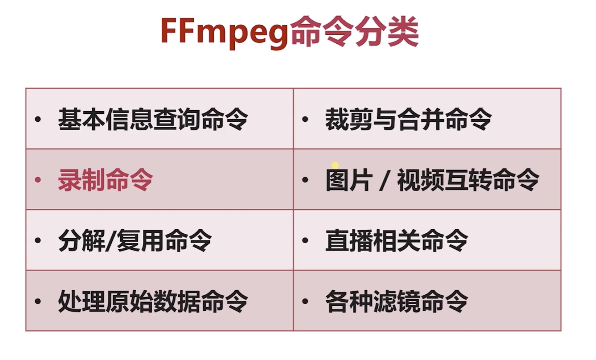

#### 2、FFmpeg 常用命令

**命令分类**


###### 1. 基本信息查询命令


实例


###### 2. 录制命令

```
录制视频
ffmpeg -f avfoundation -i 1 -r 30 out.yuv
播放视频
./ffplay -s 4096x2304 -pix_fmt uyvy422  ~/Desktop/out.yuv

录制音频
ffmpeg -f avfoundation -i :0 out.wav
播放音频
./ffplay ~/Desktop/out.wav

```


###### 3. 分解/复用命令

```
格式转换
ffmpeg -i v1.mp4 -vcodec copy -acodec copy v2.mov

抽取视频
ffmpeg -i v1.mp4 -an -vcodec copy v3.h264
抽取音频
ffmpeg -i v1.mp4 -acodec copy -vn 4.aac
```

###### 4. 处理原数据命令 2-6

###### 5. 裁剪与合并命令

###### 6. 图片/视频互转命令

###### 7. 直播相关命令

###### 8. 各种滤镜
