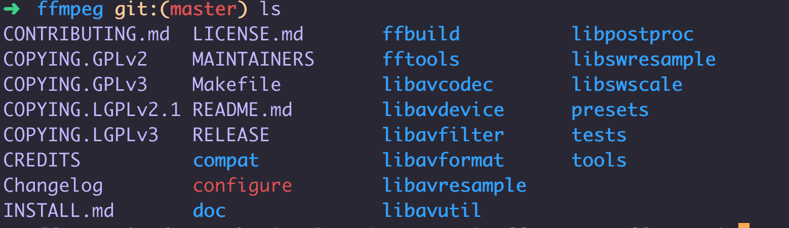

#### 1、ffmpeg 下载、编译与安装

###### 1. 下载FFmpeg
```
git clone https://git.ffmpeg.org/ffmpeg.git
```


###### 2. 查看帮助

```
./configure --help | more
```

###### 3. 编译

https://www.cnblogs.com/blackhumour2018/p/9400415.html

生成FFmpeg编译脚本
```
./configure --prefix=/usr/local/ffmpeg --enable-ffplay --enable-gpl --enable-nonfree --enable-libfdk-aac --enable-libx264 --enable-libx265 --enable-filter=delogo --enable-debug --disable-optimizations --enable-opengl --enable-libspeex --enable-libopus --enable-libmp3lame --enable-videotoolbox --enable-shared --enable-pthreads --enable-version3 --enable-hardcoded-tables --cc=clang --host-cflags= --host-ldflags=

```

安装
```
make && make install
```

环境变量配置
```
1. 查看ffmpeg安装目录
where is ffmpeg
2. 修改换将变量文件
vim ~/.bash_profile
3. 修改内容
export PATH=$PATH:/usr/local/bin/ffmpeg

使配置文件生效
source .bash_profile
```

问题

1. 安装 Pkg-config

```
下载源代码 
https://pkg-config.freedesktop.org/releases/

Compile

GLIB_CFLAGS="-I/usr/local/include/glib-2.0 -I/usr/local/lib/glib-2.0/include" GLIB_LIBS="-lglib-2.0 -lgio-2.0" ./configure --with-pc-path="/usr/X11/lib/pkgconfig:/usr/X11/share/pkgconfig:/usr/lib/pkgconfig:/usr/local/lib/pkgconfig"

编译安装

make && sudo make install

```

2. ffplay 不存在解决

```
下载地址：http://libsdl.org/release/SDL2-2.0.8.tar.gz
下载完成后解压，进入 SDL2-2.0.8 文件夹，编译并安装：
./configure && make -j 16 && sudo make install
现在SDL2安装完成，我们回到ffmpeg文件夹，重新编译就可以生成ffplay了。
到这里FFmpeg就编译完成了。
```

其他安装方法

**brew 安装使用**
```
1. 安装 brew
/usr/bin/ruby -e "$(curl -fsSL https://raw.githubusercontent.com/Homebrew/install/master/install)"

2. 使用 brew 安装 ffmpeg
$ brew install hugo

```

if you need to remove ffmpeg run:

brew uninstall ffmpeg